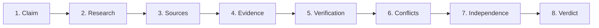

<div align="center">

# 🔍 ClaimLens 2.0

### Don't just read the claim. Read the evidence behind it.

**Eight AI agents. One claim. A verdict you can actually trace back to its sources.**

[](https://fastapi.tiangolo.com)
[](https://nextjs.org)
[](https://www.langchain.com/langgraph)
[](https://supabase.com)
[](https://netlify.com)

<br/>


</div>

<br/>

## ✨ What is ClaimLens?

Anyone can say "50,000 users" or "180% growth." Proving it is the hard part.

ClaimLens takes a raw claim and runs it through a pipeline of specialised AI agents that **search the web, grade every source, pull out the evidence, hunt for contradictions, and then commit to a verdict**, with a confidence score, an uncertainty score, and links to everything it used.

No black box. Every answer shows its homework.

| | |
|---|---|
| 🕵️ **Finds its own sources** | Live web research through Tavily, no pasted links needed |
| ⚖️ **Judges credibility** | Each source gets a quality score and a type (government, reference, primary...) |
| 🧩 **Extracts evidence** | Pulls out the exact lines that support or contradict your claim |
| ⚔️ **Catches conflicts** | Flags when sources disagree, and why |
| 🔗 **Checks independence** | Spots sources that are really just echoing each other |
| 🎯 **Admits what it doesn't know** | Reports confidence *and* uncertainty, and asks for human review when the evidence is thin |

<br/>

## 📸 See it in action

### Type a claim. Watch the agents work.

<table>
<tr>
<td width="50%">

<p align="center"><sub><b>Check a claim</b>: drop in any statement and hit go</sub></p>
</td>
<td width="50%">

<p align="center"><sub><b>Live progress</b>: follow all 8 agents as they work</sub></p>
</td>
</tr>
</table>

### Get a verdict you can defend


<p align="center"><sub>A <b>FALSE</b> verdict with 90% confidence, backed by White House and Pakistani government sources</sub></p>

<table>
<tr>
<td width="50%">

<p align="center"><sub><b>Claim verification</b>: per-claim confidence and the exact evidence behind it</sub></p>
</td>
<td width="50%">

<p align="center"><sub><b>Not everything is black and white</b>: a MIXED verdict with a flagged conflict and a human-review warning</sub></p>
</td>
</tr>
</table>

### Ask the report anything


<p align="center"><sub><b>Ask ClaimLens</b> answers only from the evidence in the current report, so it can't wander off and make things up</sub></p>

### Make it yours


<p align="center"><sub>Pick your vibe: <b>Aurora</b> (electric blue), <b>Ember</b> (coral) or <b>Verdant</b> (mint)</sub></p>

<br/>

## 🧠 How it works

Every claim travels through eight agents, each doing one job well:



| # | Agent | Job |
|---|-------|-----|
| 1 | **ClaimAgent** | Extracts and cleans up the claims from your input |
| 2 | **ResearchAgent** | Searches the web for relevant sources (Tavily) |
| 3 | **SourceAgent** | Scores each source for credibility and quality |
| 4 | **EvidenceAgent** | Extracts the passages that actually matter |
| 5 | **VerificationAgent** | Tests each claim against the collected evidence |
| 6 | **ConflictAgent** | Finds contradictions and rates their severity |
| 7 | **IndependenceAgent** | Traces citation chains to see who's quoting whom |
| 8 | **VerdictAgent** | Delivers the final verdict with confidence and uncertainty |

### The big picture

```
 Next.js frontend  ──►  FastAPI backend  ──►  LangGraph workflow (8 agents)
                                │                        │
                                ▼                        ▼
                        Supabase Postgres      Gemini · Claude · Tavily · Whisper
```

<br/>

## 🛠️ Tech stack

| Layer | Tools |
|-------|-------|
| **Frontend** | Next.js 14, React 18, TypeScript |
| **Backend** | FastAPI (Python) |
| **Orchestration** | LangGraph |
| **AI models** | Google Gemini, Anthropic Claude |
| **Search** | Tavily |
| **Database** | Supabase (PostgreSQL) |
| **Hosting** | Netlify / Vercel (frontend), Render / Railway (backend) |

<br/>

## 🚀 Quick start

**You'll need:** Python 3.10+, Node.js 18+, a Supabase project, and API keys for Gemini, Anthropic and Tavily.

### 1. Clone

```bash
git clone https://github.com/EmanFatima764/claimlens-2.git
cd claimlens-2
```

### 2. Set up the database

Create a Supabase project, open the SQL Editor, and run `backend/migrations/001_init_schema.sql`.

### 3. Start the backend

```bash
cd backend
python -m venv venv
source venv/bin/activate        # Windows: venv\Scripts\activate
pip install -r requirements.txt
cp .env.example .env            # then fill in your keys

cd ..                           # run the server from the repo root
uvicorn backend.app.main:app --reload --port 8000
```

### 4. Start the frontend

```bash
cd frontend
npm install
cp .env.example .env.local      # set NEXT_PUBLIC_API_URL=http://localhost:8000
npm run dev
```

Open **http://localhost:3000** and check your first claim. 🎉

### Prefer Docker?

```bash
docker-compose up -d --build
# Backend  → http://localhost:8000
# Frontend → http://localhost:3000
```

<br/>

## ⚙️ Environment variables

<details>
<summary><b>Backend</b> <code>.env</code></summary>

```bash
APP_ENV=development            # development | staging | production
DEBUG=true

SUPABASE_URL=https://your-project.supabase.co
SUPABASE_ANON_KEY=your_anon_key
SUPABASE_SERVICE_ROLE_KEY=your_service_role_key

GEMINI_API_KEY=your_gemini_key
ANTHROPIC_API_KEY=your_anthropic_key
TAVILY_API_KEY=your_tavily_key

CORS_ORIGINS=http://localhost:3000,https://yourdomain.com
```
</details>

<details>
<summary><b>Frontend</b> <code>.env.local</code></summary>

```bash
NEXT_PUBLIC_API_URL=http://localhost:8000
```
</details>

<br/>

## 🔌 API

Base path: `/api/v1`

| Method | Endpoint | What it does |
|--------|----------|--------------|
| `GET` | `/health` | Health check |
| `GET` | `/investigations?status=completed` | List investigations |
| `POST` | `/investigations` | Create an investigation |
| `GET` | `/investigations/{id}` | Get one investigation |
| `POST` | `/investigations/{id}/run` | Run the 8-agent workflow |
| `GET` | `/reports/{id}` | Get the full report |
| `GET` | `/reports/{id}/export?format=pdf` | Export the report |

<details>
<summary><b>Example: create an investigation</b></summary>

```bash
curl -X POST http://localhost:8000/api/v1/investigations \
  -H "Content-Type: application/json" \
  -d '{
    "title": "Verify startup metrics",
    "description": "Company claims 50k users and 180% YoY growth",
    "source_type": "text"
  }'
```
</details>

<br/>

## 📁 Project structure

```
claimlens-2/
├── backend/
│   ├── app/
│   │   ├── agents/          # the 8 agents
│   │   ├── workflows/       # graph, executor, routing, checkpoints, retries
│   │   ├── api/             # routes: health, investigations, reports
│   │   ├── services/        # investigation + report logic
│   │   ├── repos/           # database access
│   │   ├── integrations/    # Supabase, Tavily, Gemini, Anthropic, Whisper, PDF
│   │   ├── schemas/
│   │   └── core/            # logging, exceptions, constants, telemetry
│   ├── migrations/          # Supabase schema
│   └── Dockerfile
├── frontend/
│   └── src/
│       ├── app/             # landing, /investigate, /report/[id]
│       ├── components/      # investigation + report UI
│       ├── lib/             # API clients
│       └── types/
├── docs/screenshots/
├── docker-compose.yml
└── README.md
```

<br/>

## ☁️ Deployment

<details>
<summary><b>Backend → Render</b></summary>

1. Push your code to GitHub
2. Create a new **Web Service** on Render and connect the repo
3. Add your environment variables
4. Use these commands:

```bash
pip install -r backend/requirements.txt
uvicorn backend.app.main:app --host 0.0.0.0 --port 8000
```
</details>

<details>
<summary><b>Frontend → Netlify</b></summary>

1. Connect your GitHub repo
2. Build command: `npm run build`
3. Publish directory: `.next`
4. Set `NEXT_PUBLIC_API_URL=https://your-backend.onrender.com`
</details>

<br/>

## 🧪 Tests

```bash
# Backend
cd backend && pytest tests/ -v

# Frontend
cd frontend && npm run test
```

<br/>

## 🗺️ Roadmap

- **Faster runs**: move agents onto async queues (Celery + Redis) with checkpointing
- **Smarter caching**: skip re-researching claims we've already checked
- **Fact-checker integrations**: cross-reference existing fact-checking databases
- **Browser extension**: verify claims inline while you read
- **Collaboration**: investigate together in real time
- **Multi-language support**

<br/>

## 👩‍💻 Authors

<table>
<tr>
<td align="center">
<a href="https://github.com/EmanFatima764">
<b>Eman Fatima</b>
</a>
</td>
<td align="center">
<b>Ghunain Fayaz</b>
</td>
</tr>
</table>

<br/>

## 💬 Support

Found a bug or have an idea? [Open an issue](https://github.com/EmanFatima764/claimlens-2/issues) or reach us at **support@claimlens.dev**.

## 📄 License

Released under the MIT License.

<br/>

<div align="center">

**Built so that "trust me" is never the answer.**

</div>